# Semantically-Aware Contrastive Learning for Multispectral Remote Sensing Images (SACo+)

This GitHub repository contains the oficial implementation of the SACo with experiments and results using a ResNet-18 and ResNet-50 encoder trained with contrastive methods on remote sensing images. The main contributions include leveraging semantic information and texture to construct a robust feature space in the contrastive learning framework. The repository showcases performance metrics across classification, semantic segmentation, and change detection tasks, highlighting the effectiveness of integrating semantic cues and textural features in remote sensing applications.

<p align="center">
  
  
</p>

## Archicteure
The main idea behind semantic aware is to use the semantic combination of the bands from Sentinel-2 and the texture from the images in a temporal contrastive training. This involves processing augmented versions of the images at different time stamps to create a representative feature space.

### Semantic Bands

The Sentinel-2 bands are agrouped follow the logic bellow, this combination allows the image be more representative to some types of soil. Each group comprises three bands that can highlight and represent characteristics of the ground, such as vegetation, urban areas, and visible colors.

| **Groups**            | **R** | **G** | **B** |
|-----------------------|-------|-------|-------|
| Natural Colors        | B04   | B03   | B02   |
| Near-Infrared         | B08   | B04   | B03   |
| Urban                 | B12   | B11   | B04   |
| Agriculture           | B11   | B8A   | B02   |
| Atmospheric Pen.      | B12   | B11   | B8A   |
| Complementary 1       | B01   | B05   | B06   |
| Complementary 2       | B07   | B08   | B10   |

### Texture

To estimate the texture features we used a Local Binary Pattern for each band following the same groups of the semantic groups, some visual example of how these features look like.

<div style="text-align: center;">
    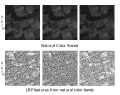
    <p><i>On the top row, the original bands were used to estimate the LBP features, while the bottom displays matrices of LBP values with the same dimensions as the original image. It is possible to observe highlighted patterns in the images, such as edges and contours.</i></p>
</div>

### Semantic Aware

The texture and semantic band features act as a kind of "guide" for the model, which is trained to process each group of bands and textures individually. This means that the output should be similar for images of the same region with different magnifications and timestamps, while at the same time increasing the dissimilarity for the other regions in the memory bank.

<p align="center">
    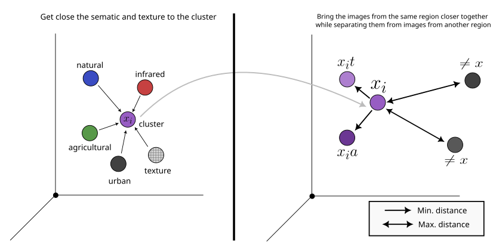
</p>


### Contrastive Training

<p><strong>Main architecture of the SACo training pipeline. It processes original, augmented, and temporally different images to produce and align feature representations.</strong></p>

<div align="center">

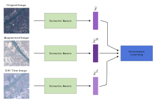

</div>

## Paper Results
We tested the encoder on three different downstream tasks—change detection, land cover classification, and semantic segmentation—and the results are in the table below. We found that using Semantic Aware with texture features in the ResNet18 encoder gave us better results than similar approaches.

| Pre-training        | Classification Accuracy ↑ | Semantic Segmentation OA (PASTIS) ↑ | Semantic Segmentation mIoU (PASTIS) ↑ | Semantic Segmentation OA (GID) ↑ | Semantic Segmentation mIoU (GID) ↑ | Change Detection Precision ↑ | Change Detection Recall ↑ | Change Detection F1 ↑ |
|---------------------|---------------------------|-------------------------------------|---------------------------------------|----------------------------------|------------------------------------|------------------------------|----------------------------|-----------------------|
| MoCo V2             | 83.72                     | 45.23                               | 24.88                                 | -                                | -                                  | 62.21                        | 27.57                      | 38.21                 |
| **SA+MoCo V2**      | **85.79**                 | 45.70                               | 25.01                                 | -                                | -                                  | 37.63                        | 48.60                      | 42.42                 |
| SeCo                | 90.05                     | 49.23                               | 25.30                                 | -                                | -                                  | **64.15**                    | 38.89                      | 46.84                 |
| CACo                | 93.08                     | 49.20                               | 26.47                                 | -                                | -                                  | 60.68                        | 42.94                      | 50.29                 |
| **SACo (Ours)**     | **94.72**                 | **54.67**                           | **29.15**                             | -                                | -                                  | 53.51                        | **48.78**                  | **52.78**             |

## Qualitative Results
Bellow some examples of the results of the model in all tasks that we had tested.

### OSCD Change detection
Visual examples of change detection task on the OSCD dataset, where each of the rows shows the input images followed by the ground truth of the pixel that had changed, and the output of the model using different weights for a ResNet-18 network.

<table style="width: 100%; text-align: center;">
  <tr>
    <td>
      
      <p>Image 1</p>
    </td>
    <td>
      
      <p>Image 2</p>
    </td>
    <td>
      
      <p>Ground truth</p>
    </td>
    <td>
      
      <p>ImageNet</p>
    </td>
    <td>
      
      <p>MoCo</p>
    </td>
    <td>
      
      <p>SA+MoCo</p>
    </td>
    <td>
      
      <p>SeCo</p>
    </td>
    <td>
      
      <p>SACo</p>
    </td>
  </tr>
  <tr>
    <td>
      
      <p>Image 1</p>
    </td>
    <td>
      
      <p>Image 2</p>
    </td>
    <td>
      
      <p>Ground truth</p>
    </td>
    <td>
      
      <p>ImageNet</p>
    </td>
    <td>
      
      <p>MoCo</p>
    </td>
    <td>
      
      <p>SA+MoCo</p>
    </td>
    <td>
      
      <p>SeCo</p>
    </td>
    <td>
      
      <p>SACo</p>
    </td>
  </tr>
</table>

### EuroSAT classification

The performance of our model on the EuroSAT dataset is evaluated using a confusion matrix. This matrix provides a detailed view of how well the model predicts each land cover class from the dataset.

<div align="center">

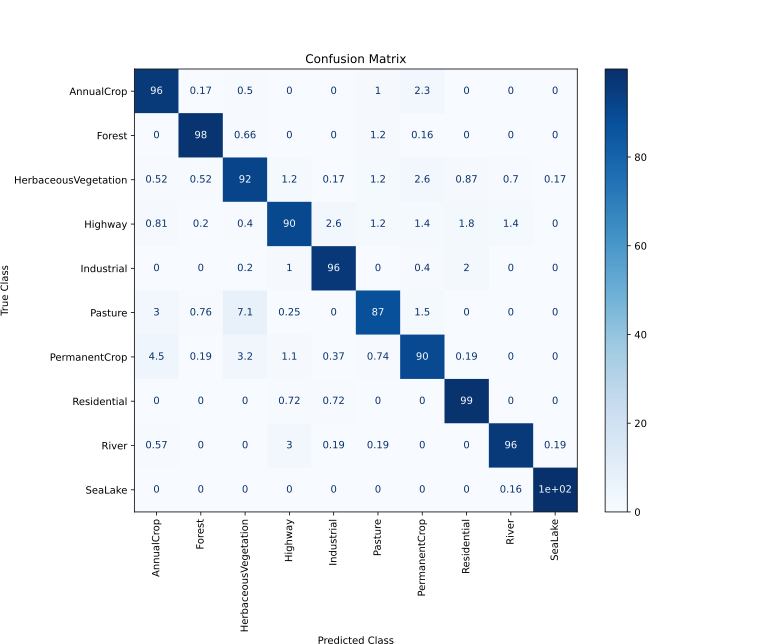

</div>


### PASTIS semantic segmentation

Visual results of the semantic segmentation predictions on the PASTIS dataset are presented, showing the input image, the ground truth, and the predictions on the test set using the trained decoder with different encoder weights.

<table style="width: 100%; text-align: center;">
  <tr>
    <td>
      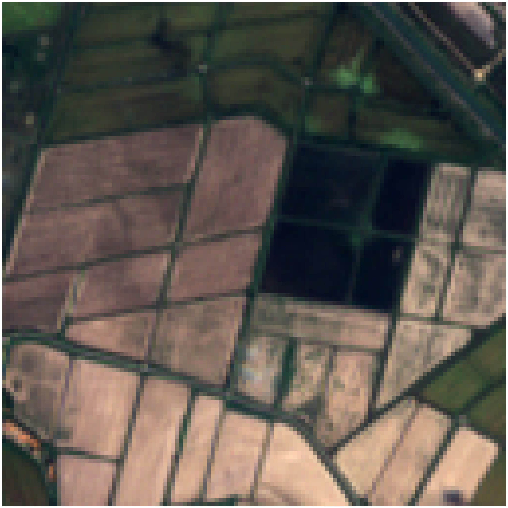
      <p>Image</p>
    </td>
    <td>
      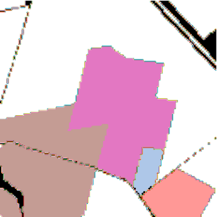
      <p>Ground truth</p>
    </td>
    <td>
      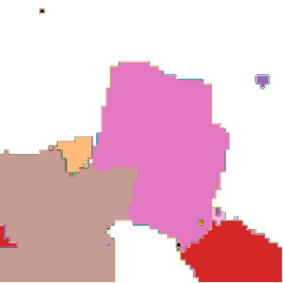
      <p>ImageNet</p>
    </td>
    <td>
      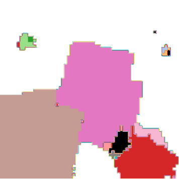
      <p>MoCo</p>
    </td>
    <td>
      
      <p>SA+MoCo</p>
    </td>
    <td>
      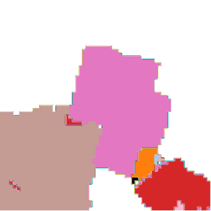
      <p>SeCo</p>
    </td>
    <td>
      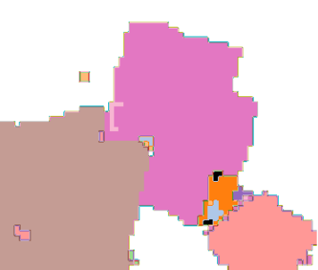
      <p>SACo</p>
    </td>
  </tr>
  <tr>
    <td>
      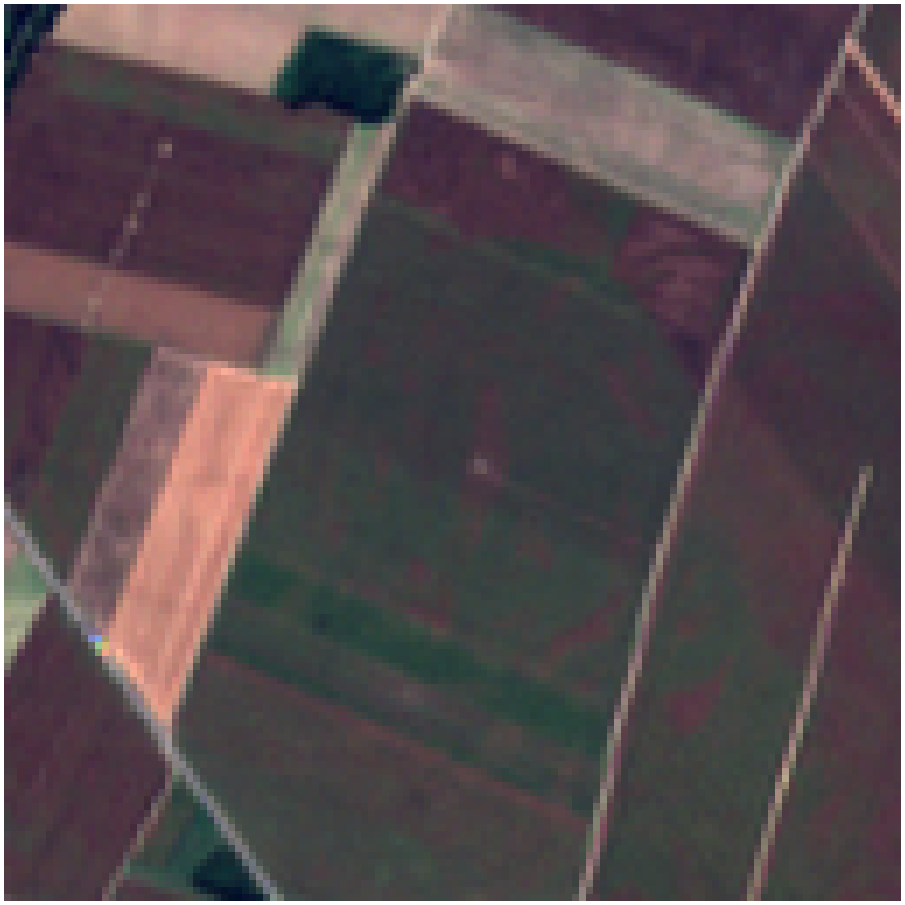
      <p>Image</p>
    </td>
    <td>
      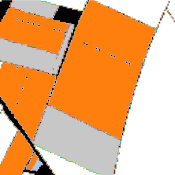
      <p>Ground truth</p>
    </td>
    <td>
      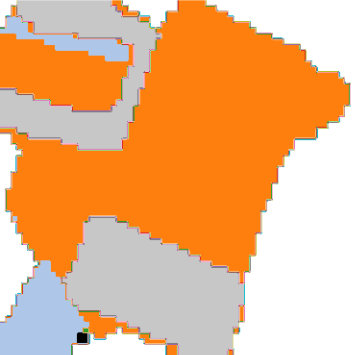
      <p>ImageNet</p>
    </td>
    <td>
      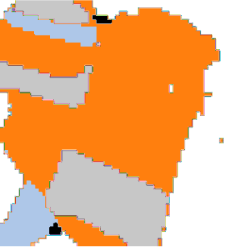
      <p>MoCo</p>
    </td>
    <td>
      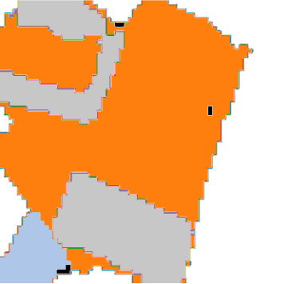
      <p>SA+MoCo</p>
    </td>
    <td>
      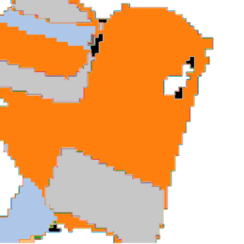
      <p>SeCo</p>
    </td>
    <td>
      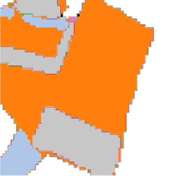
      <p>SACo</p>
    </td>
  </tr>
</table>

# How to Use This Tool

## Requirement
Make sure you’ve got these bad boys installed before you dive in:
- `torch` >= 2.0.1
- `torchvision` >= 0.15.2
- `cuda` >= 12.1
- `rasterio` >= 1.3.0

## Trained model and weights
The table below provides download links for various models used in this repository:

### Model Downloads and Evaluation Scripts

The table below provides download links for various models and their corresponding evaluation scripts:

| Model                                      | Download Link ResNet18 | Download Link ResNet50                                                | Evaluation Script Link                  |
|--------------------------------------------|------------------------------------------------------------------------------------------------|------------------------------------------------------------------------------------------------|-----------------------------------------|
| Change Detection Model                     | [Download best_model.pth](https://zenodo.org/records/13736623/files/best_change_model.pth?download=1) | XXX | [Evaluate Model](change_detection_eval.py) |
| EuroSAT LBP Classification Model           | [Download best_model.pth](https://zenodo.org/records/13736623/files/best_classification_model.pth?download=1) | XXX | [Evaluate Model](eval_classification_lbp.py) |
| Semantic Segmentation PASTIS Model         | [Download best_pixel_segmentation.pth](https://zenodo.org/records/13736623/files/best_pixel_segmentation.pth?download=1) | XXX |  [Evaluate Model](segmentation_PASTIS_eval.py) |


## Citation
```

```
